**软件说明书**

(注意，在git上因为路径原因，图片显示不了，可以在src目录中找到对应的图片，或者下载到本地打开)

[toc]

# 一、引言

​		便携本使用说明的目的是充分叙述本软件所能实现的功能及运行环境，以便使用者了解本软件的使用范围和使用方法，并为软件的维护和更新提供必要的信息。


# 二、软件概述

## 2.1软件简介

​		新型冠状病毒肺炎肆虐全球，给人们的健康和生命造成了严重的威胁，其基因型与表型信息能够使人们更好的理解该疾病的发生发展机制，利用计算方法获取新型冠状病毒肺炎相关的基因型与表型信息对其进行分析整理，将使人们进一步认识该疾病，从而辅助医疗决策。

​		软件用于提取文本中基因型、表型的实体及它们的关系。在分析后文本显示区域会高亮文本显示不同实体的类型。并在打开Neo4j服务后可以将实体关系保存至图形数据库。

​		Github源码地址：[新冠信息挖掘系统](https://github.com/yccc233/bs_uibox)


## 2.2软件运行环境

<table>
	<tr>
		<th>操作系统</th>
		<td>macOS、Windows 64位</td>
	</tr>
  <tr>
		<th>数据库(可选，不影响实体识别使用)</th>
		<td>Neo4j</td>
	</tr>
  <tr>
		<th>python环境</th>
		<td>Python==3.6</td>
	</tr>
  <tr>
		<th>设备配置</th>
		<td>CPU：1.1Hz<br/>内存：8GB<br/>硬盘：40G</td>
	</tr>
</table>


## 2.3系统配置

1.  系统应用在python3.6环境中，我们需要用到python的工具包

    [py3.6安装-官方](https://www.python.org/downloads/release/python-368/)

    使用pip安装指令如下：

    ```shell
    # /bin/bash
    $ pip install pyside2
    $ pip install py2neo
    $ pip install --upgrade https://storage.googleapis.com/tensorflow/mac/cpu/tensorflow-1.14.0-py3-none-any.whl
    ```
    
    

2.  存储三元组信息需要Neo4j服务的支持。

    ​		[安装Neo4j服务端](https://neo4j.com/download/)

    ​		根据安装界面提示一直点击<kbd>下一步</kbd>即可，安装完毕后，neo4j的默认安装路径在` “/usr/local/”`。

    ​		打开终端terminal，在指令行输入

    ```shell
    $ /usr/local/neo4j/neo4j-community-4.2.4/bin/neo4j console
    ```

    ​		稍等片刻后即可打开neo4j服务端，正确显示如下：

    ```shell
    $  /usr/local/neo4j/neo4j-community-4.2.4/bin/neo4j console
    Directories in use:
      home:         /usr/local/neo4j/neo4j-community-4.2.4
      config:       /usr/local/neo4j/neo4j-community-4.2.4/conf
      logs:         /usr/local/neo4j/neo4j-community-4.2.4/logs
      plugins:      /usr/local/neo4j/neo4j-community-4.2.4/plugins
      import:       /usr/local/neo4j/neo4j-community-4.2.4/import
      data:         /usr/local/neo4j/neo4j-community-4.2.4/data
      certificates: /usr/local/neo4j/neo4j-community-4.2.4/certificates
      run:          /usr/local/neo4j/neo4j-community-4.2.4/run
    Starting Neo4j.
    2021-06-04 06:18:39.090+0000 INFO  Starting...
    2021-06-04 06:18:42.941+0000 INFO  ======== Neo4j 4.2.4 ========
    2021-06-04 06:18:45.062+0000 INFO  Performing postInitialization step for component 'security-users' with version 2 and status CURRENT
    2021-06-04 06:18:45.063+0000 INFO  Updating the initial password in component 'security-users'  
    2021-06-04 06:18:45.493+0000 INFO  Bolt enabled on localhost:7687.
    2021-06-04 06:18:47.412+0000 INFO  Remote interface available at http://localhost:7474/
    2021-06-04 06:18:47.414+0000 INFO  Started.
    ```

    ​		在终端打印出`2021-06-04 06:18:47.414+0000 INFO  Started.`后打开浏览器，输入地址`http://localhost:7474/`后跳转到客户端界面即可完成Neo4j的安装。

    


## 2.4软件结构

​		本软件是一个前后端混合的应用程序。前段通过Qt实现的简单的用户交互的程序，通过ui组件进行交互。

​		功能实现由后端程序提供，后端程序负责命名实体的提取。neo4j的服务端与实体识别模型分隔开，在没有neo4j服务时也不影响识别模型的使用。关系如下图：

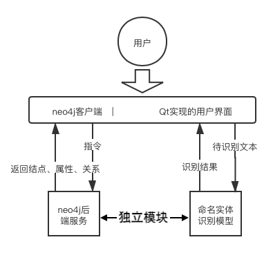


## 2.5软件性能


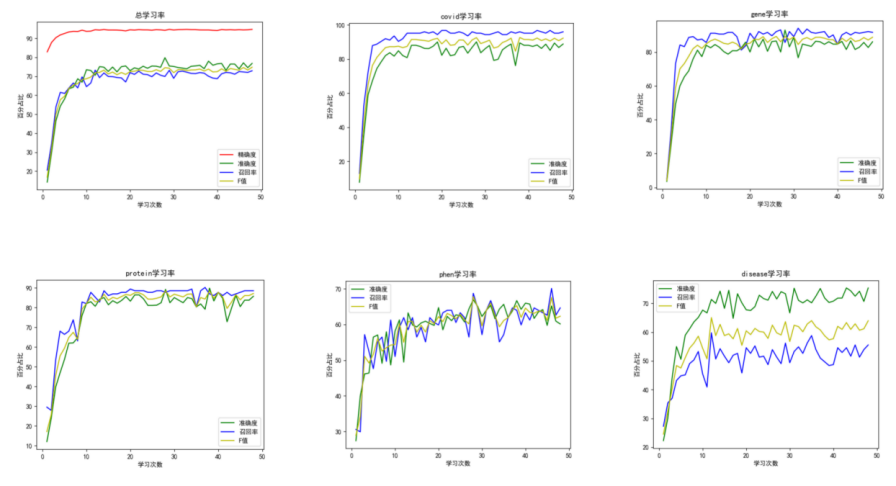

模型的识别是合并“PHEN”和“DISEASE”的，所以训练的结果如下：

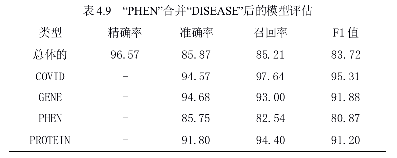


后端实现的命名实体识别性能在模型的测评上准确率达**94%**。

在分析时，系统的处理速度为**1000字符/s**；保存三元组关系时，需要建立neo4j连接，过程需要**2s**。


# 三、软件使用说明

## 3.1训练数据

​		数据集中将所有字符分为六大类：新冠（COVID）、基因（GENE）、表型（PHEN）、蛋白（PROTEIN）、疾病（DISEASE）及其他类（O）。共计约2421句话。分为三个样本，train（训练集）、test（测试集）及dev（验证集）。其中总计COVID类型有559个，GENE样本有1517个，PHEN样本有2950个，PROTEIN样本有1523个，DISEASE样本有1879个。如下表所示：

| 类别       | 句数 | COVID | GENE | PHEN | PROTEIN | DISEASE |
| ---------- | ---- | ----- | ---- | ---- | ------- | ------- |
| **训练集** | 1704 | 316   | 960  | 2395 | 1013    | 1277    |
| **测试集** | 344  | 140   | 263  | 296  | 152     | 410     |
| **验证集** | 373  | 103   | 314  | 259  | 358     | 192     |

​		**为提高模型的准确率，减少识别表型和疾病的错误率，可将PHEN和DISEASE类别的实体融合。**

​		数据集来源于两部分

-   2018年的天池比赛数据集，点击[这里](https://gitee.com/smarteas/tianchi_ruijin_knowledge_graph)获取
-   新冠研究文献的手动标注

​		以上所有数据集在[这里](https://github.com/yccc233/bs_uibox/tree/master/ner/data)，其中来源分布：

|        | 天池比赛数据集 | 文献手动标注 |
| ------ | -------------- | ------------ |
| 训练集 | 1255句         | 449句        |
| 测试集 | 98句           | 246句        |
| 验证集 | 206句          | 167句        |

​	

## 3.2软件使用

​	在GitHub中拉取项目后可以直接运行，命名实体识别的模型参数已经保存在`./ner/ckpt`中。如果想自训练，直接执行`./ner/train.py`文件即可。

1.  **启动程序**

    启动有两种方法：

    （1）**pyCharm工具**

    打开`pyCharm`后，配置环境

    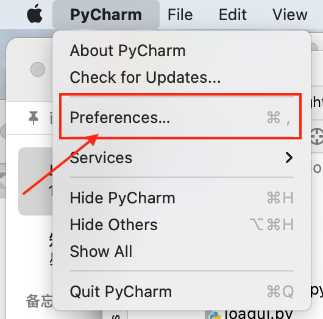

    

     **注意python环境需要3.6**，其他版本不支持*tensorflow1.14.0*。

    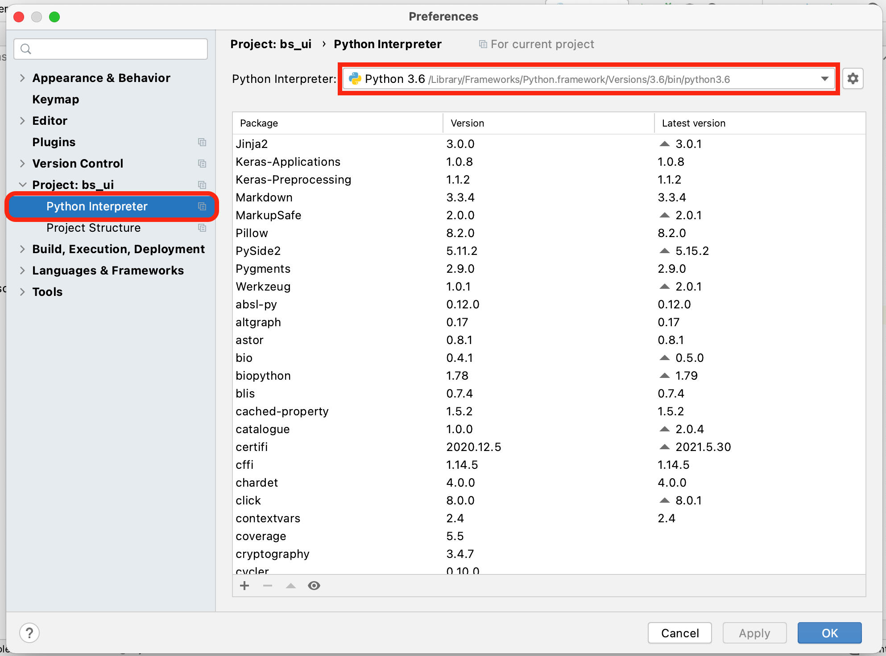

    

    环境配好后即可执行`run main`方法。

    

    （2）**终端工具terminal**

    本机带有python环境，所以使用`cd`指令到达过程目录下，调用

    ```shell
    $ python main_ui.py
    ```
    
    即可。


2.  启动程序后在一段加载动画后，即可进入主界面

    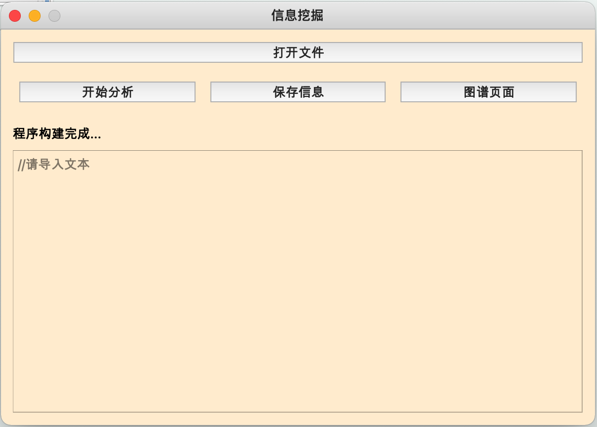

    主界面包含4个按钮

    -   <kbd>打开文件</kbd>：用户导入文本文件，选中文件后打开后即可自动加载到文本框内，当前版本导入放的文件仅支持txt格式。
    -   <kbd>开始分析</kbd>：点击分析后稍等片刻即可看到界面上识别的高亮实体。在程序的控制台可以看到分析后的所有实体及其类别。
    -   <kbd>保存信息</kbd>：保存信息需要在Neo4j服务端打开的情况下进行，否则会发出提示。
    -   <kbd>图谱页面</kbd>：点击后出现一个h5的页面，可以作为一个Neo4j的客户端，使用原生的Neo4j查看方法。
    
    以及一个文本框，文本框内存储文本，可
    
    - 导入txt文件
    - 复制文本
    - 手动编辑
    
    中间有一个标签，输出当前步状态，可以提示用户在“分析完成”或“保存信息完成”等状态。


### 3.2.1打开文件

在本地文件下有txt文件的文本可以通过文件的流处理读取内容到文本框或者可以自己编辑、粘贴等。

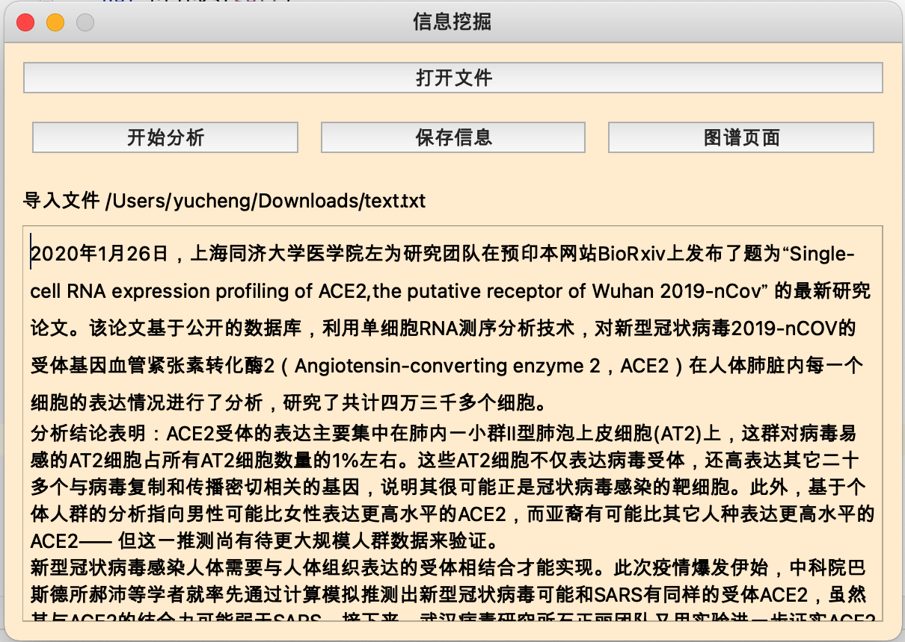


### 3.2.2开始分析

​		点击开始分析后系统自动调用后台分析文本内的数据，在控制台中的输出可以看到分析后的实体类型数据及可存储的三元组序列。

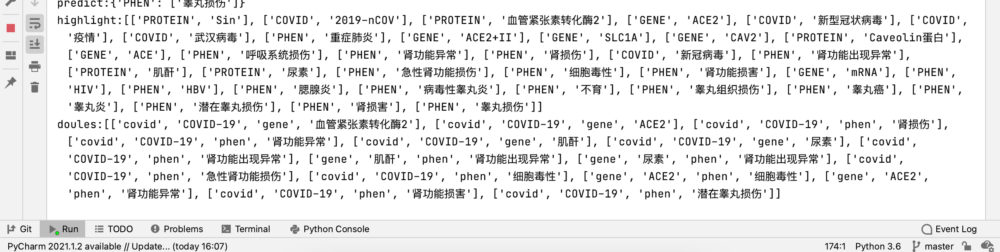

​		分析需要一些时间，约**1000字/s**。

​		分析过后可以看到界面的文本框内颜色的变化：

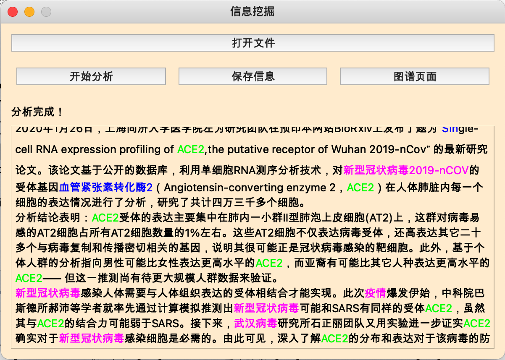


​		其中颜色表格如下：

<table style="text-align: center;">
  <tr>
    <td><b>高亮颜色</b></td>
    <td><b>实体类型</b></td>
  </tr>
  <tr>
    <td style="color:#00FF00;">绿色</td>
    <td>基因型</td>
  </tr>
  <tr>
    <td style="color:blue;">蓝色</td>
    <td>蛋白</td>
  </tr>
  <tr>
    <td style="color:#FF00FF;">紫色</td>
    <td>新冠相关</td>
  </tr>
  <tr>
    <td style="color:red;">红色</td>
    <td>表型、疾病</td>
  </tr>
</table>


### 3.2.3保存信息

​		在识别文本内容后，如果有三元组信息，会建立neo4j的连接，并保存到neo4j数据库中，保存成功后标签提示成功。

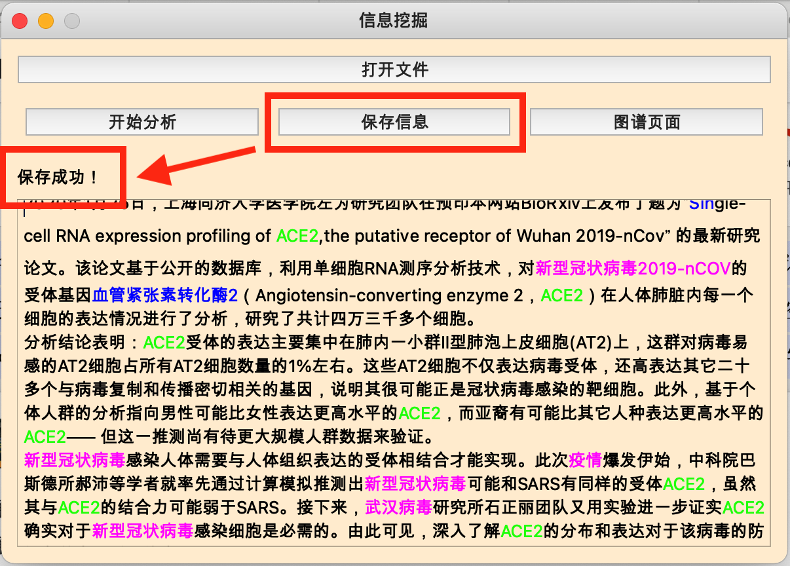


### 3.2.4图谱页面

​		打开后可以异步生成一个新的ui界面，默认前往neo4j登陆界面，输入登录的账号密码即可进入neo4j。

​		打开neo4j后，可以在两个界面之间来回切换，以及三元组数据内容的比对。

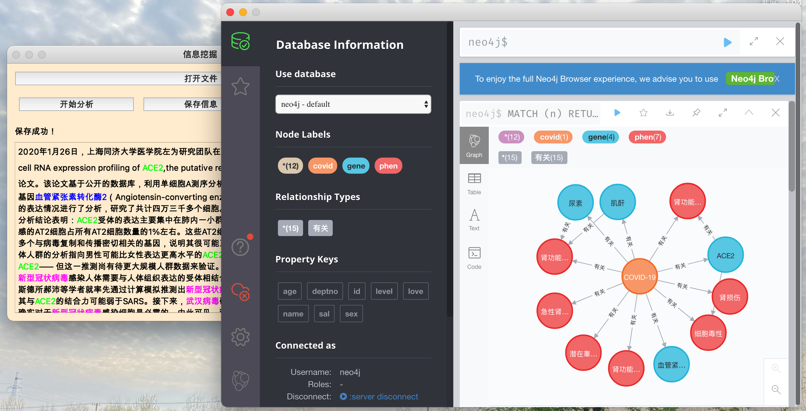


## 3.3neo4j使用

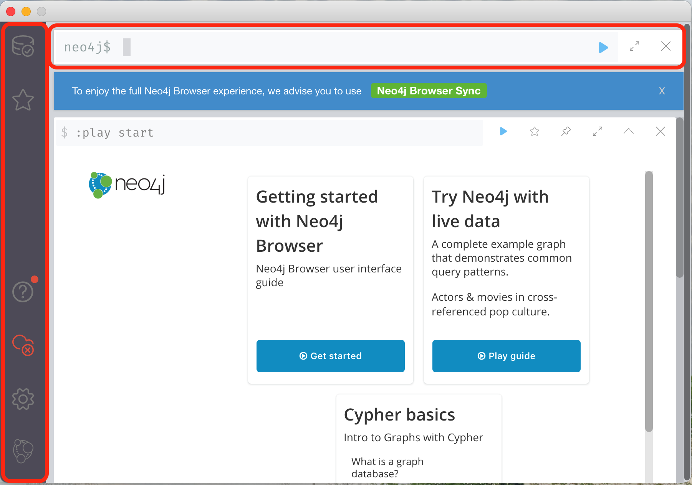

​		登陆后首先展现的是这个界面。它主要有两个部分构成

-   左侧是可视化的操作选项、使用教程等，对新手较为友好，但是功能有限，只能用于查询。
-   顶栏是指令执行框，可执行复杂的数据库语句，适合neo4j相关复杂的开发人员。


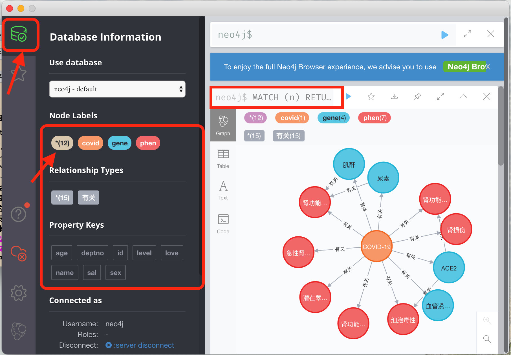

​		打开“database”后有一些结点、关系、属性的标签，点击后会自动执行match指令，并显示在右边的图形图谱中。

​		如点击<kbd style="background:#FFE4C4;border-radius:10px;border:0px">*(12)</kbd> 后执行`MATCH (n) RETURN n LIMIT 25`，可返回数据库内所有节点、关系、属性。


